# Yes24 IT 모바일 베스트셀러 데이터 분석 리포트

---

## Page 1 | 표지

# Yes24 IT 모바일 베스트셀러 데이터 분석 리포트

**데이터 기반 인사이트 도출 및 시각화 분석**

- **분석 대상**: Yes24 IT 모바일 종합 베스트셀러 1,000권
- **데이터 수집일**: 2026년 7월
- **분석 도구**: Python (Pandas, Matplotlib, Plotly)
- **발표자**: ABC-RAG 프로젝트팀

---

## Page 2 | 프로젝트 개요

# 프로젝트 개요

## 목적
- Yes24 IT 모바일 베스트셀러 데이터를 수집하고 분석하여 IT 도서 시장 트렌드 파악
- 데이터 기반 인사이트를 도출하여 출판사, 저자, 독자에게 유용한 정보 제공
- RAG 기반 AI 도서 추천 시스템의 기반 데이터 구축

## 분석 범위
| 항목 | 내용 |
|------|------|
| 데이터 소스 | Yes24 IT 모바일 종합 베스트셀러 |
| 수집 권수 | 1,000권 |
| 필드 수 | 11개 (순위, 도서명, 저자, 출판사, 출판일, 판매가, 정가, 할인율, 판매지수 등) |
| 시계열 범위 | 2010년 ~ 2026년 |
| 출판사 수 | 198개 |

---

## Page 3 | 핵심 지표 (KPI)

# 핵심 지표 대시보드

| 지표 | 값 | 설명 |
|------|-----|------|
| **총 도서 수** | 1,000권 | IT 모바일 베스트셀러 전체 |
| **평균 판매가** | 22,959원 | 중위값 21,600원 |
| **평균 판매지수** | 3,001 | 최대 82,788 |
| **출판사 수** | 198개 | 한빛미디어 1위 (151권) |
| **평균 할인율** | 9.8% | 10% 할인이 83.7% |
| **최고 판매지수** | 82,788 | 요즘 교사를 위한 AI 수업 활용 가이드 |

> **인사이트**: IT 도서 시장은 평균 2.3만원대 가격대가 주류이며, 10% 할인이 표준 관행입니다.

---

## Page 4 | 가격 분포 분석

# 가격 분포 분석

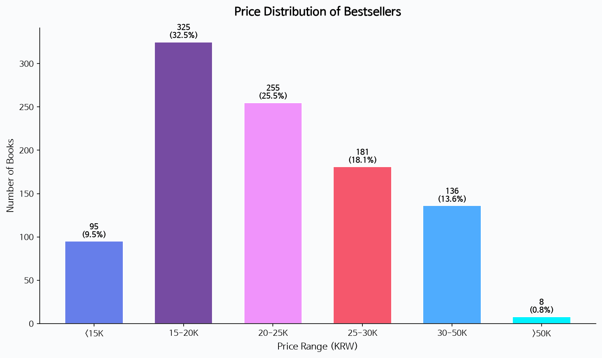

## 가격대별 분포

| 가격대 | 권수 | 비율 |
|--------|------|------|
| 1.5만원 미만 | 95권 | 9.5% |
| **1.5~2만원** | **325권** | **32.5%** |
| 2~2.5만원 | 255권 | 25.5% |
| 2.5~3만원 | 181권 | 18.1% |
| 3~5만원 | 136권 | 13.6% |
| 5만원 이상 | 8권 | 0.8% |

> **인사이트**: 전체의 **58%**가 1.5~2.5만원 구간에 분포하며, 이는 IT 도서의 합리적 가격대로 자리잡았습니다. 5만원 이상 고가 도서는 0.8%에 불과합니다.

---

## Page 5 | 출판사 시장 점유율

# 출판사 시장 점유율

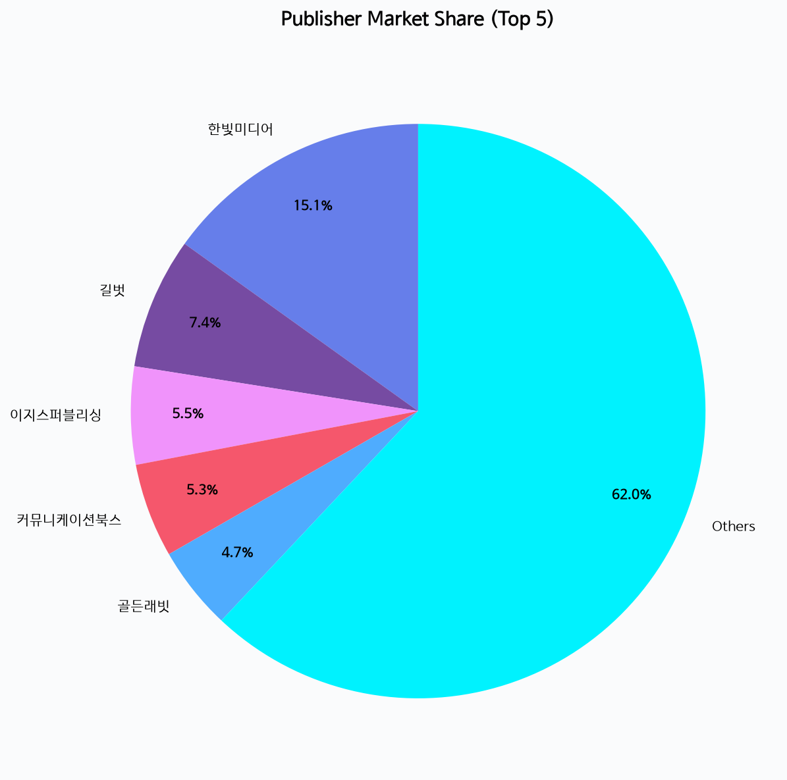

## Top 5 출판사

| 순위 | 출판사 | 도서 수 | 시장 점유율 |
|------|--------|---------|-----------|
| 1 | **한빛미디어** | 151권 | 15.1% |
| 2 | 길벗 | 74권 | 7.4% |
| 3 | 이지스퍼블리싱 | 55권 | 5.5% |
| 4 | 커뮤니케이션북스 | 53권 | 5.3% |
| 5 | 골든래빗 | 47권 | 4.7% |

> **인사이트**: 한빛미디어가 압도적 1위(15.1%)를 차지하고 있으며, Top 5 출판사가 전체의 **38%**를 점유하고 있습니다. 나머지 193개 출판사가 62%를 공유하는 분산된 시장 구조입니다.

---

## Page 6 | 출판사별 판매지수 분석

# 출판사별 판매지수 분석

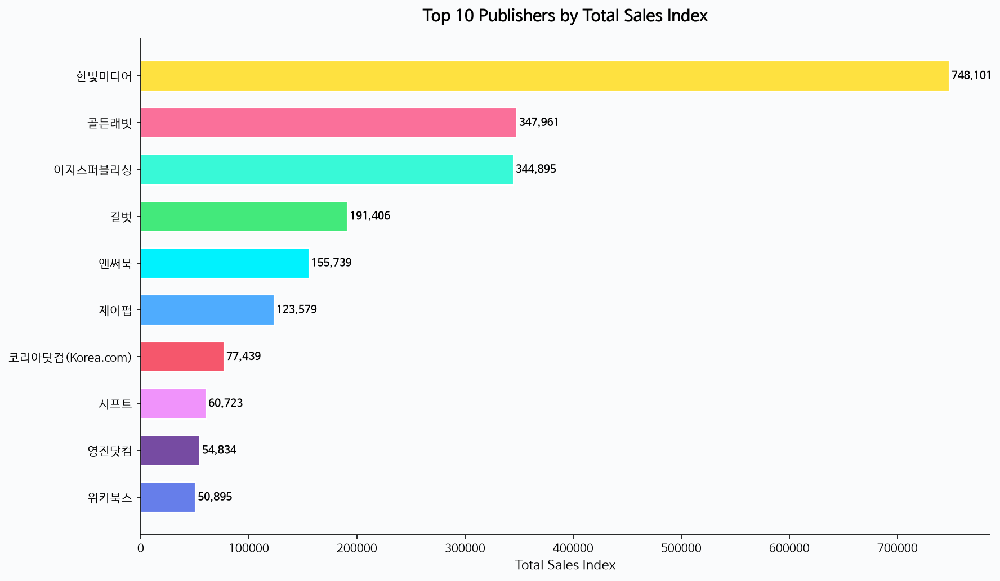

## 종합 판매지수 Top 10

| 출판사 | 도서 수 | 평균 판매지수 | 총 판매지수 | 평균 판매가 |
|--------|---------|-------------|-----------|-----------|
| 한빛미디어 | 151권 | 4,954 | 748,101 | 25,741원 |
| 골든래빗 | 47권 | 7,403 | 347,961 | 24,952원 |
| 이지스퍼블리싱 | 55권 | 6,270 | 344,895 | 21,439원 |
| 길벗 | 74권 | 2,586 | 191,406 | 23,263원 |
| 앤써북 | 33권 | 4,719 | 155,739 | 18,305원 |

> **인사이트**: 한빛미디어는 도서 수에서 압도적이나, **골든래빗은 평균 판매지수(7,403)가 가장 높아 "질적 성장" 전략이 돋보입니다.** 이지스퍼블리싱은 도서 수와 판매지수 모두 상위권으로 균형 잡힌 포트폴리오를 보유합니다.

---

## Page 7 | Top 15 판매지수 도서

# Top 15 판매지수 도서

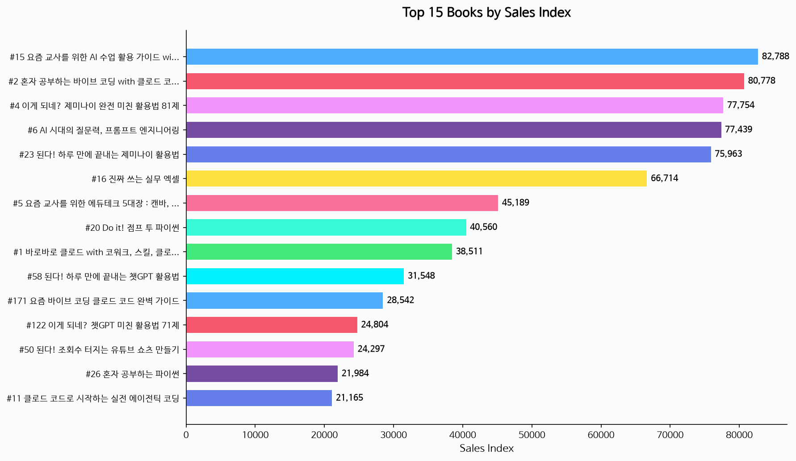

## 주목할 만한 도서

| 순위 | 도서명 | 출판사 | 판매가 | 판매지수 |
|------|--------|--------|--------|---------|
| 15 | 요즘 교사를 위한 AI 수업 활용 가이드 | 한빛미디어 | 18,000원 | **82,788** |
| 2 | 혼자 공부하는 바이브 코딩 with 클로드 코드 | 한빛미디어 | 27,000원 | **80,778** |
| 4 | 이게 되네? 제미나이 완전 미친 활용법 81제 | 골든래빗 | 21,600원 | **77,754** |
| 6 | AI 시대의 질문력, 프롬프트 엔지니어링 | 코리아닷컴 | 24,300원 | **77,439** |

> **인사이트**: Top 15 도서 중 **AI/LLM 관련 도서가 압도적**으로 높은 판매지수를 기록하고 있습니다. 특히 "바이브 코딩", "제미나이", "프롬프트 엔지니어링" 등 실무 활용서가 인기입니다.

---

## Page 8 | 연도별 출판 트렌드

# 연도별 출판 트렌드

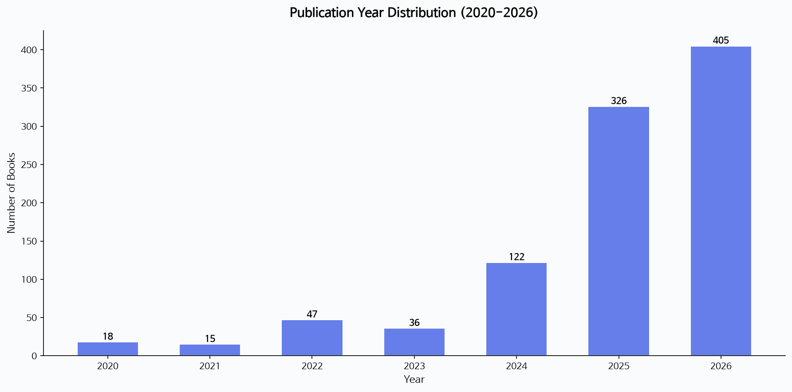

## 연도별 출판 도서 수 (2020~2026)

| 연도 | 도서 수 | 전년 대비 |
|------|---------|----------|
| 2020 | 18권 | - |
| 2021 | 15권 | -16.7% |
| 2022 | 47권 | +213.3% |
| 2023 | 36권 | -23.4% |
| 2024 | 122권 | +238.9% |
| 2025 | 326권 | +167.2% |
| 2026 | 405권 | +24.2% |

> **인사이트**: 2024년부터 IT 도서 시장이 폭발적으로 성장하고 있습니다. 2026년 현재 **405권**으로 역대 최대치를 기록 중이며, 이는 AI/LLM 열풍과 직접적으로 관련됩니다.

---

## Page 9 | 연도별 판매지수 추이

# 연도별 판매지수 추이

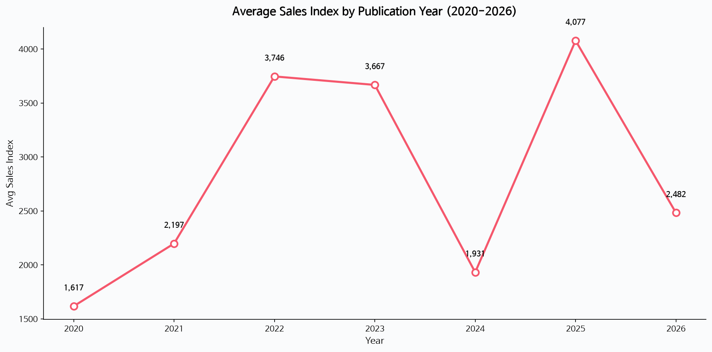

## 연도별 평균 판매지수

| 연도 | 평균 판매지수 | 특징 |
|------|-------------|------|
| 2020 | 1,617 | 코로나 초기, IT 서적 수요 증가 |
| 2021 | 2,197 | 비대면 확산 |
| 2022 | 3,746 | ChatGPT 출시 영향 |
| 2023 | 3,667 | AI 도서 급증 시작 |
| 2024 | 1,931 | 도서 수 급증으로 평균 하락 |
| 2025 | 4,077 | AI 도서 폭발, 역대 최고 |
| 2026 | 2,482 | 7월 기준, 지속 성장 중 |

> **인사이트**: 2025년 평균 판매지수(4,077)가 역대 최고치를 기록했습니다. 이는 AI/LLM 관련 도서의 높은 수요를 반영합니다. 2024년은 도서 수가 급증하면서 평균이 일시 하락했으나, 절대 판매량은 증가했습니다.

---

## Page 10 | AI/LLM 도서 vs 비-AI 도서 비교

# AI/LLM 도서 vs 비-AI 도서 비교

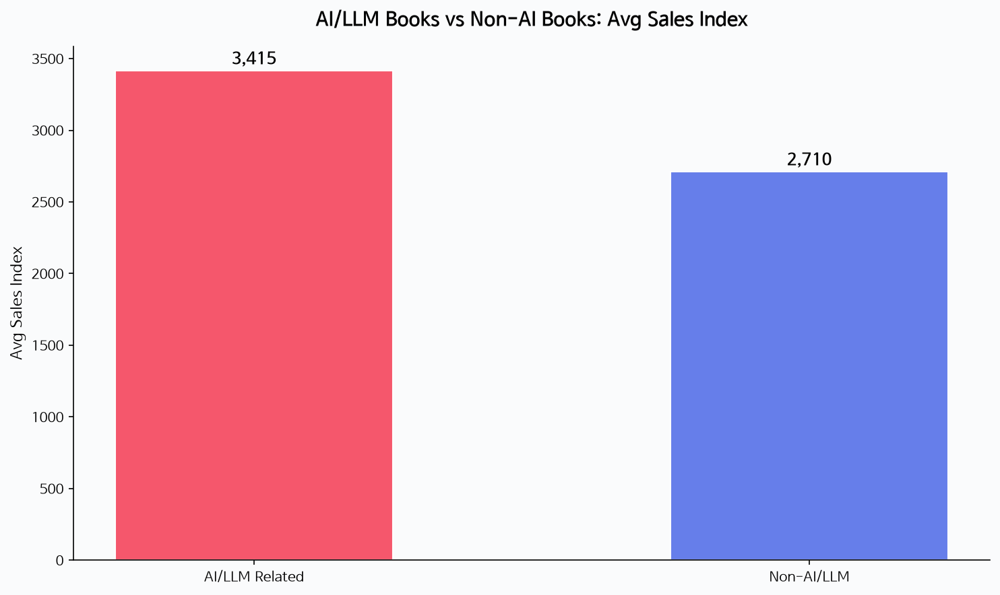

## 비교 분석

| 구분 | AI/LLM 관련 | 비-AI/LLM |
|------|------------|-----------|
| 도서 수 | **412권 (41.2%)** | 588권 (58.8%) |
| 평균 판매지수 | **3,415** | 2,710 |
| 평균 판매가 | 21,645원 | 23,879원 |

## AI 키워드별 인기 도서 유형
- **바이브 코딩**: Claude Code 활용 실무서
- **제미나이**: Google Gemini 활용 가이드
- **ChatGPT**: GPT 활용법 시리즈
- **프롬프트 엔지니어링**: AI 활용의 핵심 기술

> **인사이트**: 전체 베스트셀러의 **41.2%가 AI/LLM 관련**이며, 평균 판매지수가 비-AI 도서보다 **26% 높습니다**. AI 도서는 가격도 평균 2,234원 낮아 가성비가 뛰어납니다.

---

## Page 11 | 가격과 판매지수의 관계

# 가격과 판매지수의 관계

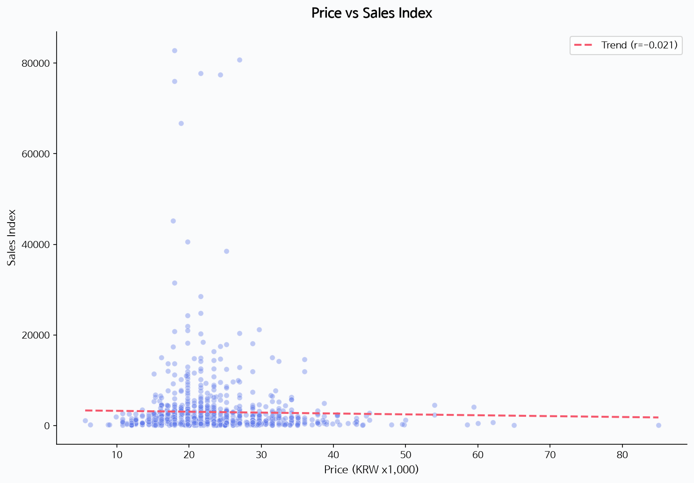

## 상관분석 결과

| 변수 간 상관계수 | 값 | 해석 |
|----------------|-----|------|
| 판매가 ↔ 판매지수 | **-0.021** | 거의 상관없음 |
| 할인율 ↔ 판매지수 | **+0.057** | 약한 양의 상관 |
| 판매가 ↔ 할인율 | **-0.094** | 약한 음의 상관 |

> **인사이트**: 가격과 판매지수 사이에는 **통계적으로 유의미한 상관관계가 없습니다**. 즉, 비싼 책이 잘 팔리지도, 싸게 팔리지도 않는다는 의미입니다. 도서의 **콘텐츠 품질과 트렌드 적합성**이 판매 성과를 결정하는 핵심 요인입니다.

---

## Page 12 | 할인율 분석

# 할인율 분석

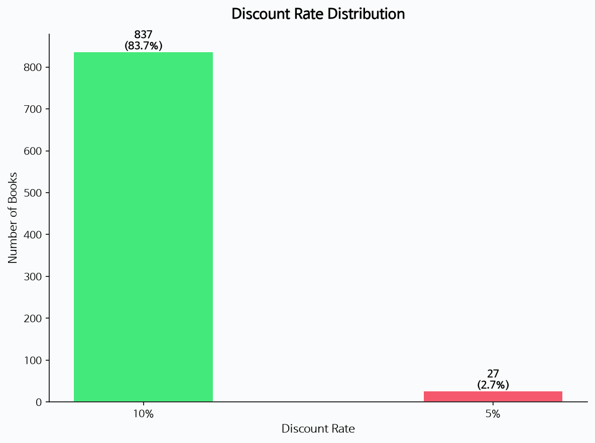

## 할인율 분포

| 할인율 | 도서 수 | 비율 |
|--------|---------|------|
| 10% | 837권 | **83.7%** |
| 5% | 27권 | 2.7% |
| 미표시/기타 | 136권 | 13.6% |

## 주목할 만한 사실
- 전체 베스트셀러의 **83.7%**가 10% 할인 판매
- 10% 할인은 IT 도서 업계의 **사실상 표준 관행**
- 할인율이 높을수록 판매지수가 약간 높아지는 경향 (r=0.057)

> **인Sİght**: IT 도서 시장에서 10% 할인은 거의 보편화된 관행입니다. 할인 경쟁보다는 **콘텐츠 차별화와 출시 시기**가 판매 성과를 더 크게 좌우합니다.

---

## Page 13 | 저자 분석

# 저자 분석

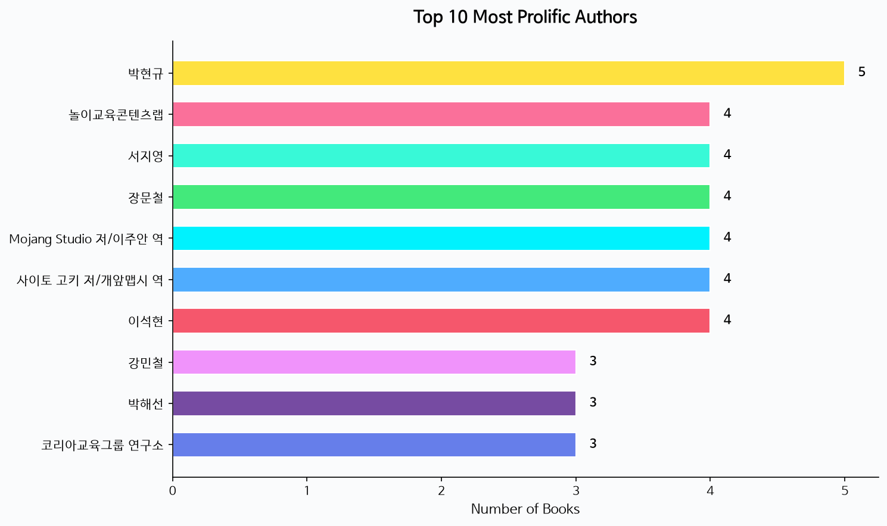

## Top 10 저자 (다작 기준)

| 순위 | 저자 | 도서 수 | 주요 분야 |
|------|------|---------|----------|
| 1 | 박현규 | 5권 | IT/프로그래밍 |
| 2 | 이석현 | 4권 | IT/프로그래밍 |
| 2 | 서지영 | 4권 | IT/프로그래밍 |
| 2 | 장문철 | 4권 | IT/프로그래밍 |
| 2 | Mojang Studio | 4권 | 게임/마인크래프트 |
| 2 | 사이토 고키 | 4권 | 자기계발 |

> **인사이트**: IT 도서 저자들은 평균 1~2권 정도만 베스트셀러에 등재하며, **지속적으로 베스트셀러를Produces하는 스타 저자는 드뭅니다**. 이는 IT 기술의 빠른 변화로 인해 신규 주제의 도서가 지속적으로 유입되는 구조를 보여줍니다.

---

## Page 14 | 출판일별 평균 판매가 추이

# 출판일별 평균 판매가 추이

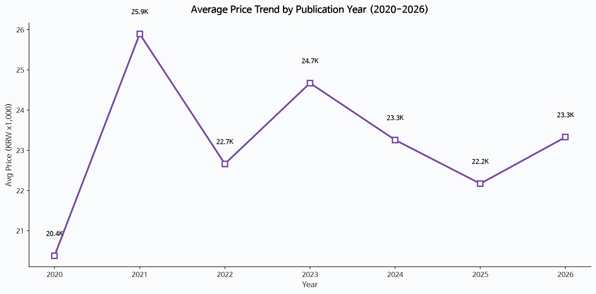

## 연도별 평균 판매가

| 연도 | 평균 판매가 | 변화 |
|------|-----------|------|
| 2020 | 20,380원 | - |
| 2021 | 25,896원 | +27.1% |
| 2022 | 22,664원 | -12.5% |
| 2023 | 24,674원 | +8.9% |
| 2024 | 23,259원 | -5.7% |
| 2025 | 22,172원 | -4.7% |
| 2026 | 23,329원 | +5.2% |

> **인사이트**: 최근 3년간 평균 판매가는 **22,000~24,000원대**에서 안정적으로 유지되고 있습니다. AI 도서의 대중화로 인해 가격대가 하향 안정화되는 추세입니다.

---

## Page 15 | 출판사별 가격 전략 분석

# 출판사별 가격 전략 분석

## 주요 출판사 가격 비교

| 출판사 | 평균 판매가 | 평균 할인율 | 전략 |
|--------|-----------|-----------|------|
| 한빛미디어 | 25,741원 | 9.8% | 프리미엄 전략 |
| 위키북스 | 27,657원 | 9.8% | 고급参考서 |
| 시프트 | 27,423원 | 9.8% | 전문서적 |
| 앤써북 | 18,305원 | 9.8% | 가성비 전략 |
| 영진닷컴 | 20,303원 | 9.8% | 접근성 중심 |
| 이지스퍼블리싱 | 21,439원 | 9.8% | 균형 전략 |

> **인사이트**: 출판사별로 **2,000원 이상의 가격 차이**가 존재합니다. 앤써북은 평균 18,305원으로 가장 저렴한 반면, 위키북스는 27,657원으로 가장 비쌉니다. 가격보다는 **도서의 실용성과 트렌드 매칭**이 판매에 더 중요합니다.

---

## Page 16 | 시장 세그멘테이션

# IT 도서 시장 세그멘테이션

## 4대 세그먼트

### 1. AI/LLM 실무 활용서 (41.2%)
- 대표: 바이브 코딩, 제미나이 활용법, ChatGPT 활용법
- 특징: 높은 판매지수, 빠른 출판 주기
- 가격대: 18,000~27,000원

### 2. 프로그래밍 학습서 (25.0%)
- 대표: 혼자 공부하는 파이썬, Do it! 시리즈
- 특징: 꾸준한 수요, 교육 시장 연계
- 가격대: 19,000~28,000원

### 3. IT 실무/생산성 (20.0%)
- 대표: 진짜 쓰는 실무 엑셀, 유튜브 쇼츠
- 특징:广泛的受众, 높은 실용성
- 가격대: 15,000~22,000원

### 4. 전문서적/심화 (13.8%)
- 대표: 딥러닝, 클라우드, 보안
- 특징: 꾸준한 수요, 전문 독자층
- 가격대: 25,000~50,000원

---

## Page 17 | 주요 인사이트 종합

# 주요 인사이트 종합

## 5대 핵심 발견

### 1. AI/LLM이 시장을 지배한다
- 전체 베스트셀러의 **41.2%**가 AI 관련
- 판매지수가 비-AI 대비 **26% 높음**

### 2. 한빛미디어의 시장 리더십
- 도서 수 **15.1%**로 압도적 1위
- 총 판매지수 **748,101**로 2위와 2배 이상 격차

### 3. 가격은 판매 성과를 결정하지 않는다
- 상관계수 **-0.021** (거의 없음)
- 콘텐츠 품질과 트렌드가 핵심

### 4. 10% 할인이 표준
- 전체의 **83.7%**가 10% 할인
- 할인 경쟁보다 차별화가 중요

### 5. 2024년부터 폭발적 성장
- 2024년 122권 → 2026년 **405권**
- AI 열풍이 시장 성장의 핵심 동력

---

## Page 18 | 전략적 제언

# 전략적 제언

## 출판사별 전략

### 한빛미디어 (시장 리더)
- AI 도서 포트폴리오 강화
- 골든래빗 대비 낮은 평균 판매지수(4,954) 개선 필요
- 프리미엄 가격 유지 + 품질 차별화

### 골든래빗 (품질 리더)
- 평균 판매지수 **7,403**으로 업계 최고
- 도서 수 확대 (현재 47권 → 70권 이상)
- AI 활용서 시장 선점 강화

### 이지스퍼블리싱 (균형형)
- 가격 경쟁력(21,439원) 유지
- 판매지수(6,270)와 도서 수(55권)의 균형
- 신규 카테고리 확장 (클라우드, 보안)

## 신규 진입자
- AI/LLM 실무서 집중 (가장 높은 수요)
- 18,000~22,000원 가격대 진입
- 한글화/실습 중심 도서 선호 트렌드 활용

---

## Page 19 | 데이터 기반 예측

# 데이터 기반 시장 예측

## 2026년 하반기 전망

| 예측 항목 | 전망 | 근거 |
|----------|------|------|
| AI 도서 비중 | **50% 이상** | 현재 41.2%, 월간 증가 추세 |
| 평균 판매가 | 22,000~23,000원 | 안정세 유지 |
| 신규 출판사 진입 | 증가 | 시장 성장세 |
| 평균 판매지수 | 3,500 이상 | AI 도서 인기 지속 |

## 주목할 만한 트렌드
1. **에이전틱 코딩**: Claude Code 기반 자율 코딩 도서 증가
2. **멀티모델 활용**: ChatGPT + Gemini + Claude 병행 가이드
3. **교육 분야 AI**: 교사/강사 대상 AI 활용서 급증
4. **생산성 도구**: 유튜브, 노션 등 실용서 지속 인기

---

## Page 20 | 결론 및 향후 계획

# 결론 및 향후 계획

## 핵심 결론

> **IT 도서 시장은 AI/LLM 열풍으로 역사적 전환점에 서 있습니다.**
>
> 2026년 현재 405권의 베스트셀러가 등재되어 역대 최대치를 기록 중이며, 이 중 41.2%가 AI 관련 도서입니다. 시장은 빠르게 성장하고 있으며, 콘텐츠의 품질과 트렌드 적합성이 판매 성과를 결정하는 핵심 요인입니다.

## 향후 계획
1. **데이터 갱신**: 월 1회 자동 스크래핑으로 최신 데이터 유지
2. **RAG 챗봇 고도화**: 사용자 맞춤형 도서 추천 정확도 개선
3. **시계열 분석**: 월별/분기별 트렌드 모니터링 대시보드 구축
4. **감성 분석**: 도서 리뷰 기반 수요 예측 모델 개발

---

**감사합니다**

ABC-RAG 프로젝트 | Yes24 IT 모바일 베스트셀러 분석
